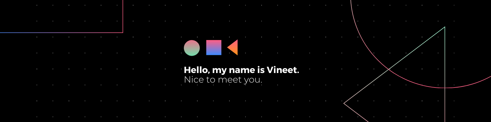
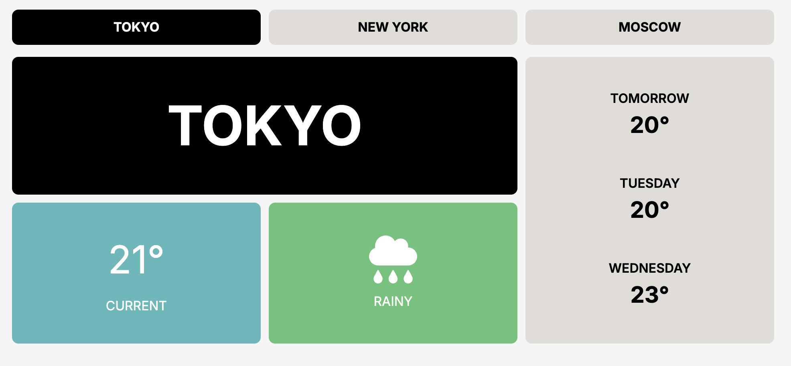
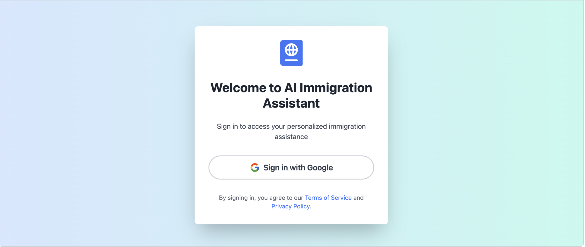

# Vineet Sagar

  

## 🚀 Developer | Full-Stack Engineer | AI Enthusiast

I’m a software engineer with 9+ years of experience in full-stack development, web solutions, and cloud architecture. I love exploring new technologies and solving real-world problems with practical, impactful solutions. Always learning, always building.

### 🌟 Career Highlights

- Engineered a vertical AI platform integrating Google's Gemini and Imagen, implementing parallel request processing and real-time monitoring using Flutter, Supabase, and PostgreSQL
- Developing an AI-first virtual clothing try-on application using React Native, Python, TensorFlow, and Comfy-UI
- Led migration to Kubernetes, reducing deployment times by 60% and improving development lifecycle
- Designed and optimized a diarization pipeline using AWS, enhancing throughput and system performance
- Developed a Purchasing flow supporting 14 countries, implementing SaaS pricing models

### 💻 Tech Stack

### 🏆 Featured Projects

<table>
  <tr>
    <td align="center">
      <a href="https://actofy.ai">
        
         
        <b>Actofy.ai E-Learning</b>
      </a>
    </td>
    <td align="center">
      <a href="https://wonderpack.com">
        
         
        <b>AI Clothing Try-On</b>
      </a>
    </td>
    <td align="center">
      <a href="https://ovou.com/">
        
         
        <b>ovou</b>
      </a>
    </td>
    <td align="center">
      <a href="https://weather-app-zeta-swart.vercel.app/">
        
         
        <b>weather</b>
      </a>
    </td>
    <td align="center">
      <a href="https://ai-immigration-assistant-zeta.vercel.app/auth/signin">
        
         
        <b>Immigration Assistant</b>
      </a>
    </td>
  </tr>
</table>

### 📈 GitHub Stats

  

### 🎓 Education

- Bachelor's in Computer Science and Engineering, MAIT, IP University, New Delhi (2011-2015)

### 🏅 Publications

- [Token-based solution to the ME problem in mobile ad-hoc environment](https://drive.google.com/file/d/1iq1nH6Vm5RuwaZ0s8fNpzS4H9Ex1d0OY/view?usp=sharing)

  
  
  

